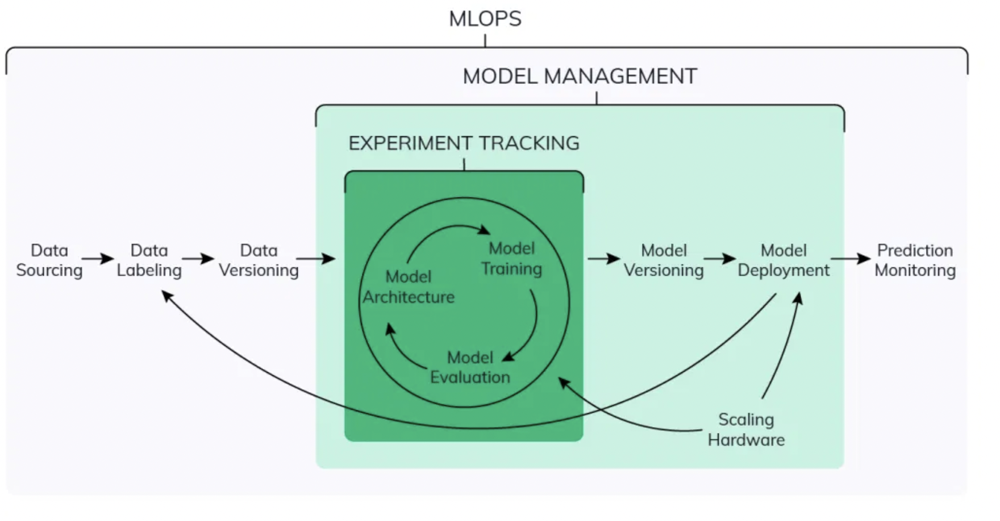

## Experiment Tracking

Machine learning requires experimenting with a wide range of datasets, data preparation steps, and algorithms to build a model that maximizes some target metric. Once you have built a model, you also need to deploy it to a production system, monitor its performance, and continuously retrain it on new data and compare with alternative models.

Being productive with machine learning can therefore be challenging for several reasons:
- **It’s difficult to keep track of experiments**
- **It’s difficult to reproduce code** (Even if you have meticulously tracked the code versions and parameters, you need to capture the whole environment (for example, library dependencies) to get the same result again)
- **There’s no standard way to package and deploy models**
- **There’s no central store to manage models** (their versions and stage transitions)

### MLFLow

#### [Components](https://mlflow.org/docs/latest/concepts.html#mlflow-components)

- **MLflow Tracking**
    - is an API and UI
        - for logging parameters, code versions, metrics, and artifacts when running your machine learning code and for later visualizing the results.
        - that allows keep track of all the relevant information from an ML experiment, which includes (source code, environment, data, model, hyperparameters, metrics, etc.)
    - allows you to organize your runs in to experiments. You can check how to [organize Runs in Experiements](https://mlflow.org/docs/latest/tracking.html#organizing-runs-in-experiments)

- **MLflow Registry** is a centralized model store, set of APIs, and UI, to collaboratively manage the full lifecycle of an MLflow Model.

- **MLflow Project*** is simply a directory with code or a Git repository, and uses a descriptor file or simply convention to specify its dependencies and how to run the code.
- **MLflow Models** offer a convention for packaging machine learning models in multiple flavors, and a variety of tools to help you deploy them. Each Model is saved as a directory containing arbitrary files and a descriptor file that lists several “flavors” the model can be used in

#### Key Concepts

Why it is important? -> Reproducibility, Optimization, Organization

For storing Runs and Artifacts, MLflow uses two components for storage: backend store and artifact store.
While the backend store persists MLflow entities (runs, parameters, metrics, tags, notes, metadata, etc), the artifact store persists artifacts (files, models, images, in-memory objects, or model summary, etc). You can check how [runs and artifacts are recorded](https://mlflow.org/docs/latest/tracking.html#how-runs-and-artifacts-are-recorded)

Experiment Metadata

## Model Management
Model Versioning, Model Lineage

## Model Registry + Model Deployment

- Consider model training time, model size and error value when deciding model to production.

# Resources
- [ML Experiment Tracking: What It Is, Why It Matters, and How to Implement It?](https://neptune.ai/blog/ml-experiment-tracking)